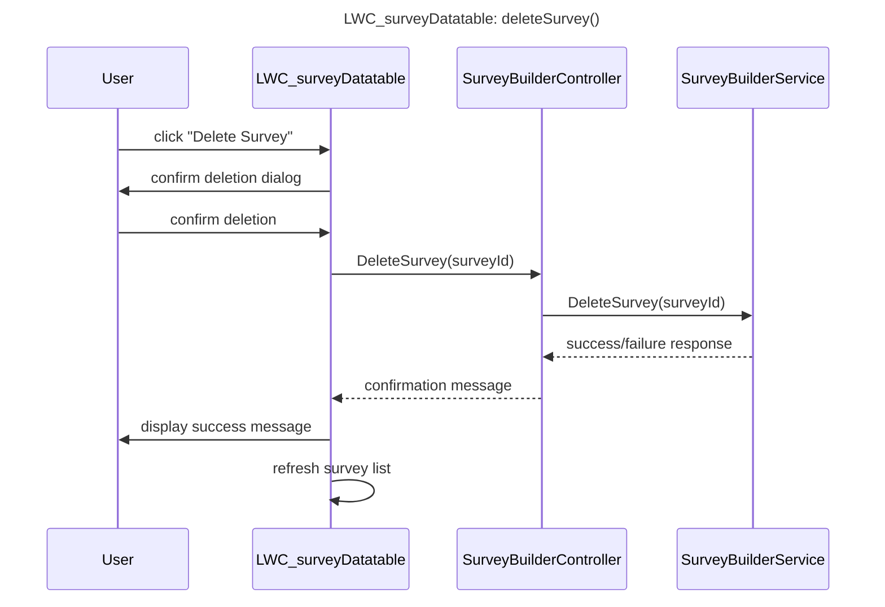

```mermaid
sequenceDiagram
    title LWC_surveyDatatable: deleteSurvey()
    
    User->>LWC_surveyDatatable: click "Delete Survey"
    LWC_surveyDatatable->>User: confirm deletion dialog
    User->>LWC_surveyDatatable: confirm deletion
    LWC_surveyDatatable->>SurveyBuilderController: DeleteSurvey(surveyId)
    SurveyBuilderController->>SurveyBuilderService: DeleteSurvey(surveyId)
    SurveyBuilderService-->>SurveyBuilderController: success/failure response
    SurveyBuilderController-->>LWC_surveyDatatable: confirmation message
    LWC_surveyDatatable->>User: display success message
    LWC_surveyDatatable->>LWC_surveyDatatable: refresh survey list
``` 