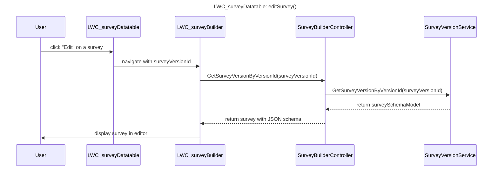

```mermaid
sequenceDiagram
    title LWC_surveyDatatable: editSurvey()
    
    User->>LWC_surveyDatatable: click "Edit" on a survey
    LWC_surveyDatatable->>LWC_surveyBuilder: navigate with surveyVersionId
    LWC_surveyBuilder->>SurveyBuilderController: GetSurveyVersionByVersionId(surveyVersionId)
    SurveyBuilderController->>SurveyVersionService: GetSurveyVersionByVersionId(surveyVersionId)
    SurveyVersionService-->>SurveyBuilderController: return surveySchemaModel
    SurveyBuilderController-->>LWC_surveyBuilder: return survey with JSON schema
    LWC_surveyBuilder->>User: display survey in editor
``` 