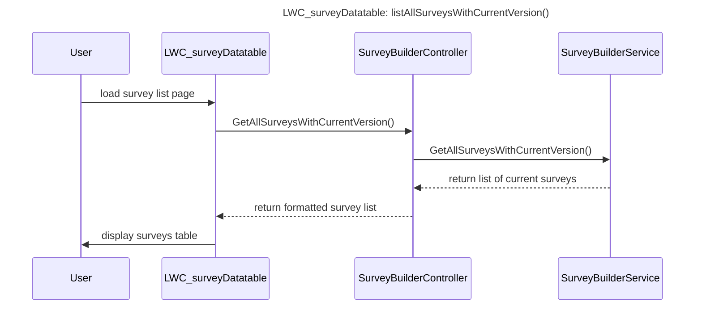

```mermaid
sequenceDiagram
    title LWC_surveyDatatable: listAllSurveysWithCurrentVersion()
    
    User->>LWC_surveyDatatable: load survey list page
    LWC_surveyDatatable->>SurveyBuilderController: GetAllSurveysWithCurrentVersion()
    SurveyBuilderController->>SurveyBuilderService: GetAllSurveysWithCurrentVersion()
    SurveyBuilderService-->>SurveyBuilderController: return list of current surveys
    SurveyBuilderController-->>LWC_surveyDatatable: return formatted survey list
    LWC_surveyDatatable->>User: display surveys table
``` 