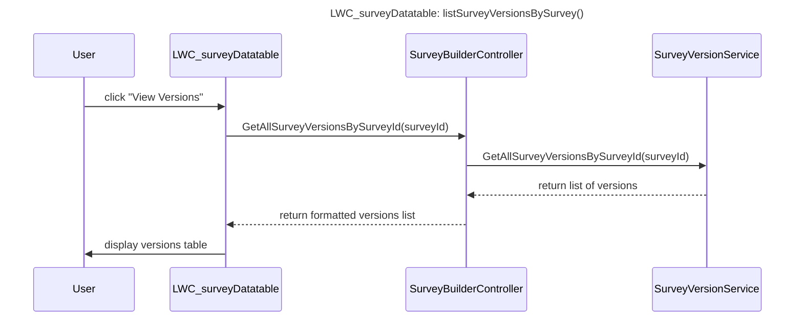

```mermaid
sequenceDiagram
    title LWC_surveyDatatable: listSurveyVersionsBySurvey()
    
    User->>LWC_surveyDatatable: click "View Versions"
    LWC_surveyDatatable->>SurveyBuilderController: GetAllSurveyVersionsBySurveyId(surveyId)
    SurveyBuilderController->>SurveyVersionService: GetAllSurveyVersionsBySurveyId(surveyId)
    SurveyVersionService-->>SurveyBuilderController: return list of versions
    SurveyBuilderController-->>LWC_surveyDatatable: return formatted versions list
    LWC_surveyDatatable->>User: display versions table
``` 