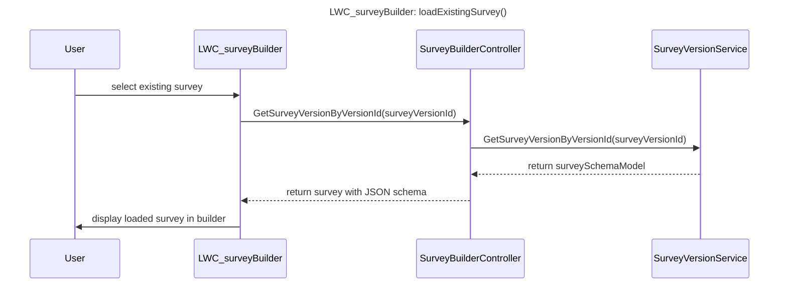

```mermaid
sequenceDiagram
    title LWC_surveyBuilder: loadExistingSurvey()
    
    User->>LWC_surveyBuilder: select existing survey
    LWC_surveyBuilder->>SurveyBuilderController: GetSurveyVersionByVersionId(surveyVersionId)
    SurveyBuilderController->>SurveyVersionService: GetSurveyVersionByVersionId(surveyVersionId)
    SurveyVersionService-->>SurveyBuilderController: return surveySchemaModel
    SurveyBuilderController-->>LWC_surveyBuilder: return survey with JSON schema
    LWC_surveyBuilder->>User: display loaded survey in builder
``` 