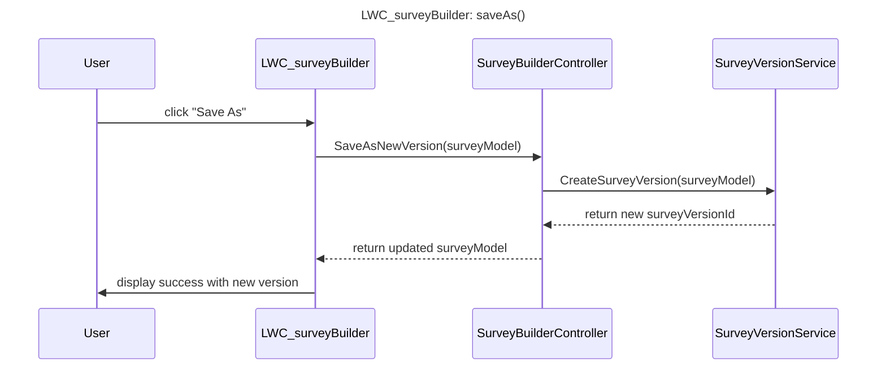

```mermaid
sequenceDiagram
    title LWC_surveyBuilder: saveAs()
    
    User->>LWC_surveyBuilder: click "Save As"
    LWC_surveyBuilder->>SurveyBuilderController: SaveAsNewVersion(surveyModel)
    SurveyBuilderController->>SurveyVersionService: CreateSurveyVersion(surveyModel)
    SurveyVersionService-->>SurveyBuilderController: return new surveyVersionId
    SurveyBuilderController-->>LWC_surveyBuilder: return updated surveyModel
    LWC_surveyBuilder->>User: display success with new version
``` 