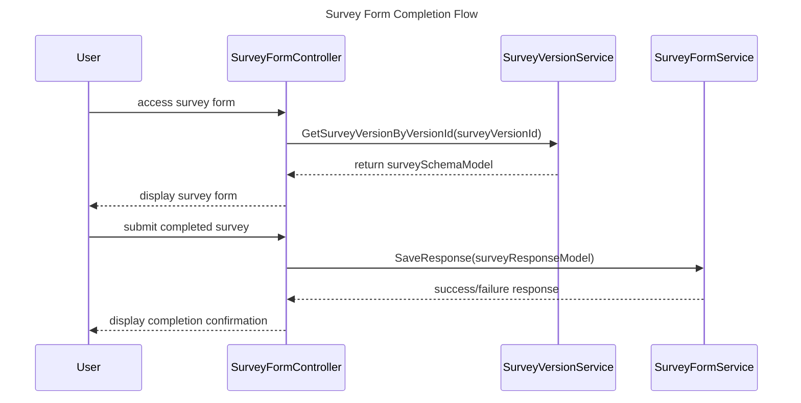

```mermaid
sequenceDiagram
    title Survey Form Completion Flow
    
    User->>SurveyFormController: access survey form
    SurveyFormController->>SurveyVersionService: GetSurveyVersionByVersionId(surveyVersionId)
    SurveyVersionService-->>SurveyFormController: return surveySchemaModel
    SurveyFormController-->>User: display survey form
    
    User->>SurveyFormController: submit completed survey
    SurveyFormController->>SurveyFormService: SaveResponse(surveyResponseModel)
    SurveyFormService-->>SurveyFormController: success/failure response
    SurveyFormController-->>User: display completion confirmation
``` 